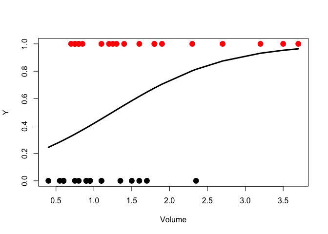

# Stat447B: Lecture 7 - Logistical Regression
Niels Hanson  
September 25, 2014  

## Logistic Regression

* Looking at the Vaso Constriction Skin Data Set `vaso`, it contains 39 observations on 3 variables:
    * `Volume`: the inhaled volume of air
    * `Rate`: the rate of inhalation
    * `Y`: a vector of 0 or 1 values


```r
help(vaso, package='robustbase')
# Get data
data(vaso, package = 'robustbase')
head(vaso)
```

```
##   Volume  Rate Y
## 1   3.70 0.825 1
## 2   3.50 1.090 1
## 3   1.25 2.500 1
## 4   0.75 1.500 1
## 5   0.80 3.200 1
## 6   0.70 3.500 1
```

### Overview

* The probabilities $p_i$ are determined by only two parameters, $\beta_0$ and $\beta_0$.

$$
p_i = Pr(Y_i = 1 | v = v_i) = \frac{exp(\beta_0 + \beta_1 v_i)}{1 + exp(\beta_0 + \beta_1 v_i)},
$$
where $v_i$ is the Volume of a datapoint in `vaso`

* And we maximize the likelihood over $\beta_0$ and $\beta_1$

$$
L(y_1, \ldots, y_n; v_1, \ldots, v_n; \beta_0, \beta_1)
$$

* And given a realized value for the volume $V$, the predicted probability $Y=1$ is

$$
\frac{exp( \hat{\beta}_0 + \hat{\beta}_1 v )}{1 + exp( \hat{\beta}_0 + \hat{\beta}_1 v )}
$$

####Requirements:

* model has to be linear in the parameters $\beta_0$ and $\beta_1$
* maps (predicts) to the mean of $y$ (i.e., its expected value)
* restricted to a particular family of distributions (exponential)
* optimized via iterative least-squares

Fitting the one variable regression model with Volume:


```r
# Logistic regression on Volume
plot(Y ~ Volume, data = vaso, pch = 19, col = Y + 1, cex = 1.5)
vaso.glm1 <- glm(Y ~ Volume, data = vaso, family = 'binomial')
lines(sort(vaso$Volume), vaso.glm1$fitted.values[order(vaso$Volume)], 
   lwd = 3, cex = 1.25)
```

 

* The curive is the prediction of $Pr(Y=1)$, note its *logistic* shape
* Doesn't look like a very good fit, so how about we fit the second variable `Rate`
    * $\boldsymbol{x}_i = (v_i, r_i) = (Volume_i, Rate_i)$
    * the linear predictor $\eta(\boldsymbol{x}_i) = \beta_0 + \beta_1 v_i + \beta_2 r_i$
    * the probability $p_i$ is calculated as
    $$
    p_i = \frac{exp( \eta( \boldsymbol{x}_i) )}{1 + exp( \eta( \boldsymbol{x}_i) )}
    $$

```r
vaso.glm2 <- glm(Y ~ Volume + Rate, data = vaso, family = 'binomial')
```

#### Clicker Question 1

* Should `Rate` be in the model?


```r
summary(vaso.glm2)
```

```
## 
## Call:
## glm(formula = Y ~ Volume + Rate, family = "binomial", data = vaso)
## 
## Deviance Residuals: 
##    Min      1Q  Median      3Q     Max  
## -1.507  -0.735   0.040   0.488   2.329  
## 
## Coefficients:
##             Estimate Std. Error z value Pr(>|z|)   
## (Intercept)   -9.530      3.233   -2.95   0.0032 **
## Volume         3.882      1.429    2.72   0.0066 **
## Rate           2.649      0.914    2.90   0.0038 **
## ---
## Signif. codes:  0 '***' 0.001 '**' 0.01 '*' 0.05 '.' 0.1 ' ' 1
## 
## (Dispersion parameter for binomial family taken to be 1)
## 
##     Null deviance: 54.040  on 38  degrees of freedom
## Residual deviance: 29.772  on 36  degrees of freedom
## AIC: 35.77
## 
## Number of Fisher Scoring iterations: 6
```

* `Rate` variable seems to be highly significant from the $z$ value test, but assumptions of normality are abound.

### Model Comparison via Liklihood Ratio Tests

* Recall from Statistical Inference that Wilk's approximate likelihood ratio test is

$$
W = 2 \times ln \left(\frac{\mbox{liklihood of unrestricted model}}{\mbox{likelihood of model under } H_0}\right) \sim \chi^2 \mbox{ under }H_0
$$
with degrees of freedom being the difference in the number of parameters.

Here the *restricted model* is the smaller one parameter model, while the *unrestricted model* is our two parameter model.

#### Analysis of Deviance

Notice that 2 times the log of the liklihood ratio is twice the difference of 2 ln likelihood:

$$
2 ln\left(\frac{L_1}{L_2}\right) = 2 (ln(L_1) - ln(L_2))
$$

It is often convenience to use the *Deviance*, $D$, which is mathematically equivalent:

$$
D = 2 \left( ln(L_{saturated}) - ln(L_{unsaturated}) \right)
$$

* *Staturated* generally referring to the larger model
* The staturated model has the best possible liklihood
* For Bernouli data, the best possible $p_i$ is $\hat{p}_i = Y_i$ (a perfect fit)
    * It can be shown that the deviance here is
    $$
    D = 2\left[ \sum_{i=1} y_i ln \left( \frac{y_i}{\hat{p}_i} \right) + (1-y_i) ln \left( \frac{1 - y_i}{1 - \hat{p}_i} \right) \right]
    $$
    * A larger likelihood corresponds to a smaller devidance
    * A small devidance in the absence of overfitting is good. Much like the residual sum of squares, it means that your model is fitting to the data well


Going back to our example we can see that the Deviance of our two model fits is reported:


```r
D_1 = vaso.glm1$deviance
D_2 = vaso.glm2$deviance
D_diff = D_1 - D_2
```

Model 1 has a deviance of 46.9894, while Model 2 has 29.7723. The difference is 17.2171.

### Activity

* What is the null hypothesis $H_0$ in our current formulation?

Usually the smaller model. 

* What is $W$, i.e. the change in the deviance of the two models?

17.2171

* To test $H_0$, how many degrees of freedom are used in the $\chi^2$ distribution?

This is the difference in the degrees of freedom of each model. So 1.

* Is $H_0$ rejected?


```r
pval = (1- pchisq(q = D_diff, df = 1)) * 100
```

17.2171 is a very extreme value for the $\chi^2_1$ distrbituion. 

## Comparison via Misclassification Rate

* For regression, error was mesured via the root mean squared error (RMSE)

$$
RMSE = \sqrt{\frac{1}{n}\sum_{i=1}^n (y_i - \hat{y}(x_i))^2}
$$

* for classification the fitted vales are $\hat{p}_i$
* We an turn the $\hat{p}_i$ into hard (0/1) predictions by thesholding

$$
\hat{y}_i = \begin{cases} 0 &\mbox{if } \hat{p}_i \leq 0.5 \\ 
1 & \mbox{if } \hat{p}_i \gt 0.5 \end{cases} 
$$

If our hard prediction equals our estimate, $y_i = \hat{y}_i$, this is 0 or *no error*, and is 1 otherwise. This can be summarized in a *missclassifcation matrix*, *missclassification table*, or *confusion matrix*, depending on which domain you are working in. 

* Which model predicts the training data better?

* After performing 10-fold CV:

* What is the best explaination for why the larger model predicted better? 

* The gain is variance was offset by a larger loss in bias.
